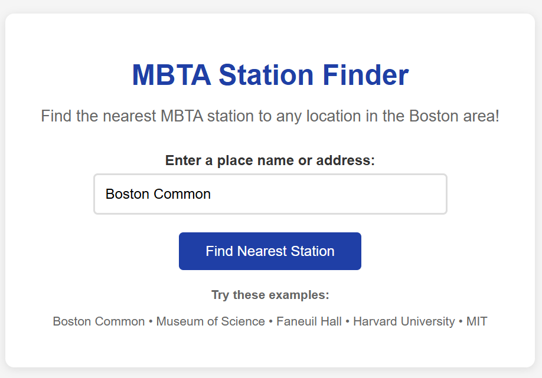
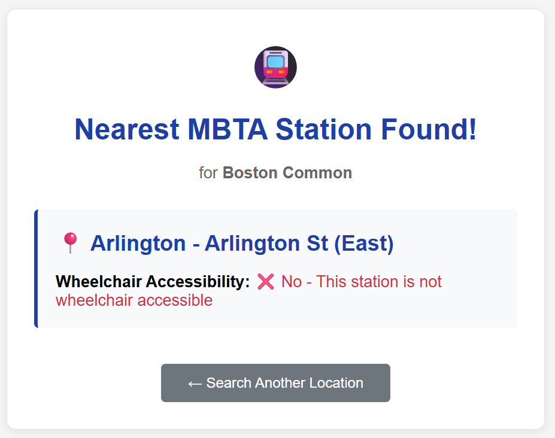
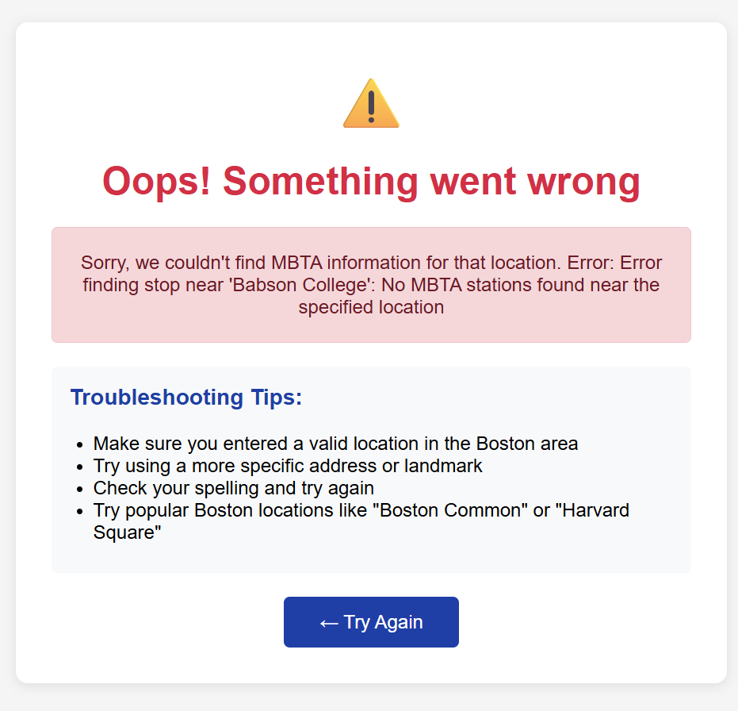

# MBTA Web App Project
**Team Members:** Ana Koniashvili
## Project Overview
This web application helps users find the nearest MBTA (Massachusetts Bay Transportation Authority) station to any location in the Greater Boston area. Users can enter a place name or address through a simple web interface, and the application will return the closest MBTA stop along with information about wheelchair accessibility. The project combines web APIs (Mapbox Geocoding and MBTA Realtime API) with Flask web development to create a practical tool for Boston-area transportation planning.
The application features a clean, user-friendly interface with error handling and responsive design. Key functionality includes geocoding user input to coordinates, finding the nearest transit stop using distance-sorted API queries, and presenting results in an accessible format with clear wheelchair accessibility indicators.
## Setup Instructions
### Prerequisites
- Python 3.7+
- pip package manager
### Installation
1. **Clone the repository:**
   ```bash
   git clone: https://github.com/akoniashvili1/MBTA-Web-App-Project-Ana.git
   ```
2. **Install required packages:**
   ```bash
   pip install flask python-dotenv
   ```
3. **Set up API keys:**
   
   Create a `.env` file in the project root directory with your API keys:
   ```
   **Get API Keys:**
   - **Mapbox Token:** Sign up at [Mapbox](https://account.mapbox.com/) and get a free access token
   - **MBTA API Key:** Register at [MBTA V3 API Portal](https://api-v3.mbta.com/) for a free API key
4. **Test the helper functions:**
   ```bash
   python mbta_helper.py
   ```
5. **Run the web application:**
   ```bash
   python app.py
   ```
   
## Features
### Core Functionality
- **Location Input:** Enter any place name or address in the Boston area
- **Geocoding:** Converts location names to precise coordinates using Mapbox API
- **Station Finding:** Locates the nearest MBTA station using distance-sorted queries
- **Accessibility Information:** Shows whether the station is wheelchair accessible
- **Error Handling:** Graceful error messages for invalid locations or API issues
### Web Interface
- **Responsive Design:** Works well on desktop and mobile devices
- **Clean UI:** Intuitive form-based interface with helpful examples
- **Visual Feedback:** Clear results presentation with icons and color coding
- **Navigation:** Easy return to search from results or error pages
### Technical Features
- **Environment Variables:** Secure API key storage using `.env` files
- **JSON Processing:** Robust parsing of API responses
- **URL Encoding:** Proper handling of special characters in location names
- **Flask Templating:** Dynamic content rendering with Jinja2 templates
## File Structure
```
/MBTA-Web-App-Project
├── static/                 # Static files (CSS, JS, images) - if any
├── templates/              # HTML templates
│   ├── index.html         # Home page with search form
│   ├── mbta_station.html  # Results display page
│   └── error.html         # Error handling page
├── .env                   # Environment variables (API keys)
├── .gitignore            # Git ignore file
├── mbta_helper.py        # Core API functions
├── app.py               # Flask web application
└── README.md           # This file
```
## Usage Examples
### Testing the Helper Functions
```python
import mbta_helper
# Find nearest station to Boston Common
station, accessible = mbta_helper.find_stop_near("Boston Common")
print(f"Station: {station}, Wheelchair Accessible: {accessible}")
# Test with coordinates
lat, lng = mbta_helper.get_lat_lng("Harvard University")
print(f"Harvard coordinates: {lat}, {lng}")
```
## API Integration
### Mapbox Geocoding API
- **Purpose:** Convert place names/addresses to coordinates
- **Usage:** Takes location string, returns latitude/longitude
- **Rate Limits:** Free tier includes generous usage limits
### MBTA Realtime API
- **Purpose:** Find nearest transit stations
- **Usage:** Takes coordinates, returns sorted list by distance
- **Features:** Includes accessibility information and station details
## Error Handling
The application includes comprehensive error handling for:
- **Invalid Locations:** Clear messages when geocoding fails
- **API Failures:** Graceful degradation when APIs are unavailable
- **Missing API Keys:** Helpful setup instructions
- **Empty Input:** Form validation and user guidance
- **Network Issues:** Timeout and connection error management
## Reflection
### Development Process
The development process went smoothly overall, with clear separation between the API integration (Part 1) and web application development (Part 2). The modular approach of implementing helper functions first made debugging much easier when integrating with Flask. 
One challenge was handling the different coordinate formats between APIs - Mapbox returns coordinates as [longitude, latitude] while MBTA expects separate latitude and longitude parameters. This was resolved through careful API documentation review and testing with known locations.
The error handling implementation proved valuable during development, as it helped identify API key configuration issues and invalid location inputs quickly. Testing with various Boston locations revealed that some areas outside the immediate Boston area don't have nearby MBTA stations, leading to helpful error messages for users.
### Team Work Division
Working individually on this project, I was responsible for all aspects of development:
**Planning Phase:**
- Read through API documentations for both Mapbox and MBTA
- Set up development environment and API keys
- Designed the basic application flow
**Implementation Phase:**
- Implemented core API functions (`get_json`, `get_lat_lng`, `get_nearest_station`)
- Created Flask application with proper routing
- Developed HTML templates with responsive design
- Added comprehensive error handling
**Testing Phase:**
- Tested helper functions with various Boston locations
- Verified web interface functionality across different browsers
- Validated error handling with invalid inputs
If I were to work on a similar project in the future with a team, I would suggest dividing the work as follows: one person focusing on API integration and backend logic, while another works on Flask routing and frontend development. This would allow for parallel development and specialized focus areas.
### Learning Perspective
This project significantly enhanced my understanding of web APIs and full-stack development. Key learning outcomes include:
**API Integration Skills:**
- Understanding RESTful API patterns and JSON data structures
- Implementing proper URL encoding and parameter handling
- Managing API keys securely using environment variables
- Debugging API responses and handling rate limits
**Web Development with Flask:**
- Creating dynamic web applications with proper MVC architecture
- Using Jinja2 templating for dynamic content rendering
- Implementing form handling and POST request processing
- Designing responsive web interfaces with CSS
**Error Handling and User Experience:**
- Building robust applications that gracefully handle failures
- Providing meaningful error messages to users
- Implementing proper input validation and sanitization
**AI Tools Usage:**
I used AI tools primarily for debugging assistance and code review, which enhanced my efficiency by helping me identify potential issues early in development. The AI was particularly helpful in suggesting proper error handling patterns and CSS styling improvements. However, I found that understanding the underlying concepts myself was crucial for effective debugging when issues arose.
**Future Applications:**
The skills learned in this project will be valuable for future web development projects, particularly those involving third-party API integration. Understanding how to properly handle asynchronous data requests, parse JSON responses, and create user-friendly web interfaces are fundamental skills for modern web development.
## Screenshots


 -> location:  Babson College
